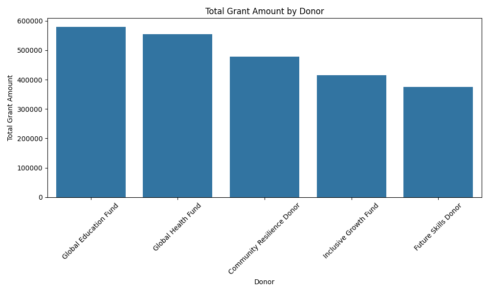
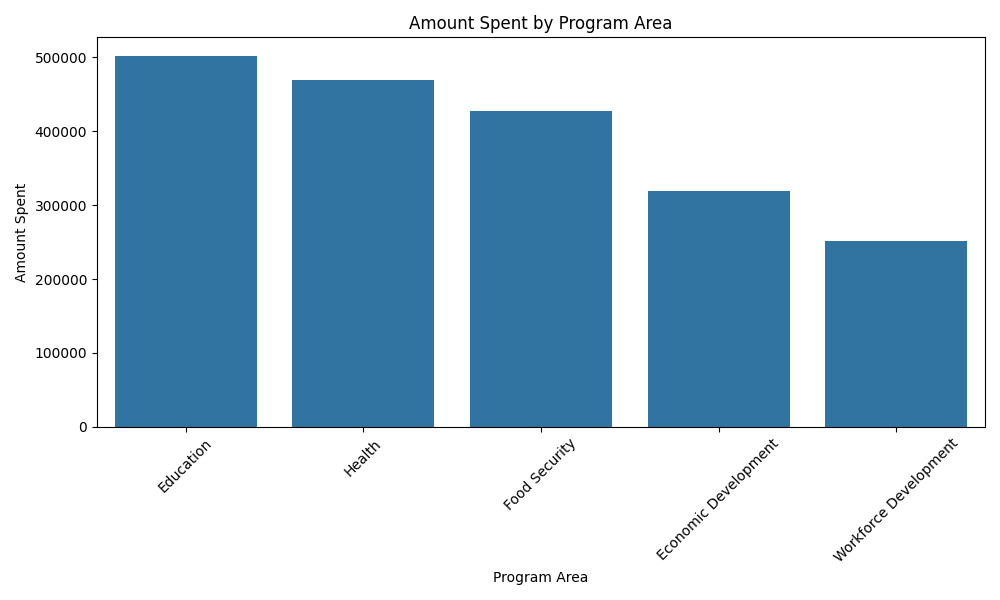
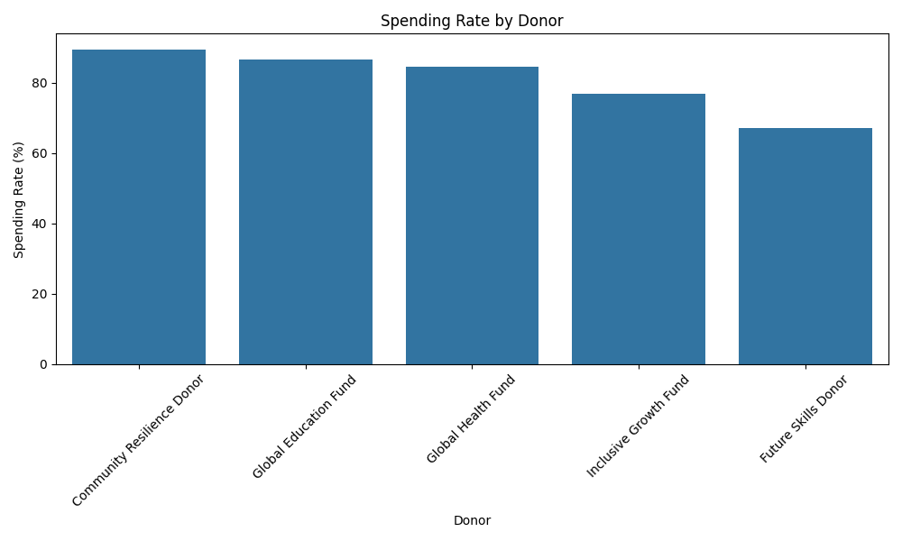
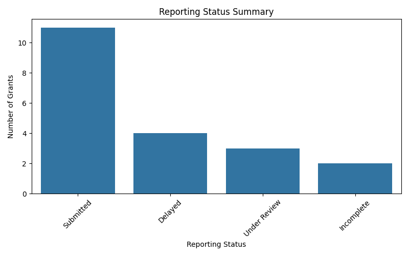
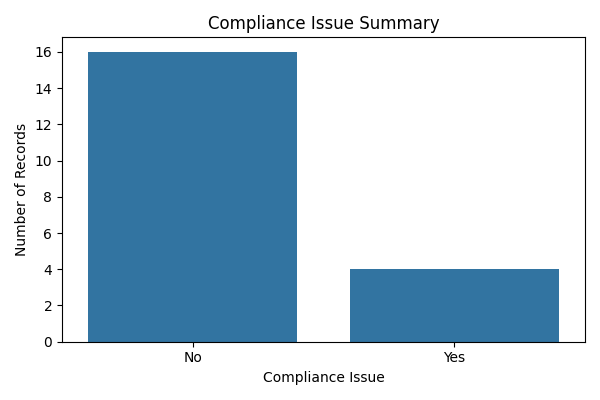
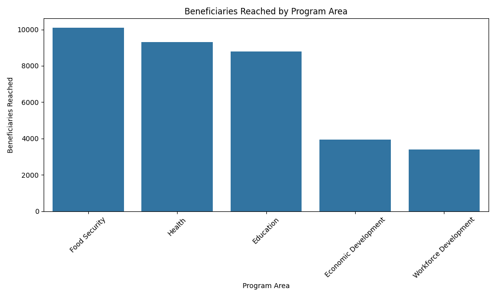
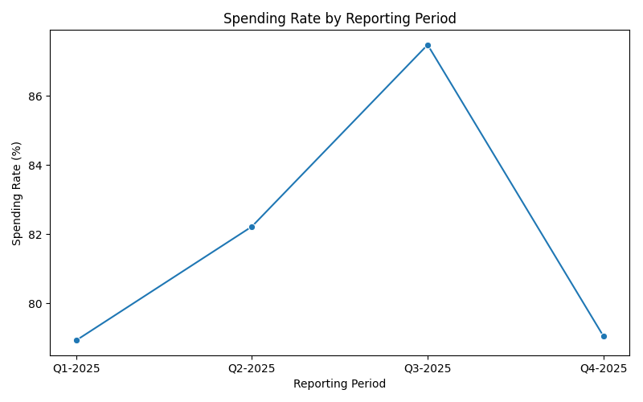

# Nonprofit Grant Reporting Data System

## Project Overview

This project is a data analytics portfolio project focused on nonprofit grant reporting, donor accountability, compliance monitoring, and program performance tracking.

It demonstrates how grant data can be organized, cleaned, analyzed, queried, visualized, and documented using Python, SQL, and structured reporting workflows.

---

## Problem Statement

Nonprofit organizations often manage multiple grants across donors, program areas, regions, and reporting periods. Each grant may include funding amounts, spending progress, reporting status, compliance requirements, and beneficiary reach.

Without a structured grant reporting data system, it can be difficult to answer important questions such as:

- Which donors provide the largest grant amounts?
- Which program areas have the highest spending?
- Which grants have low spending rates?
- Which grants have delayed or incomplete reports?
- Are there compliance issues that require follow-up?
- How many beneficiaries were reached by program area?
- Which grants require management attention?

---

## Objectives

The main objectives of this project are to:

- Build a structured nonprofit grant reporting dataset
- Use Python to clean, transform, and summarize grant data
- Use SQL to analyze donor funding, spending rates, compliance issues, and reporting status
- Create visualization scripts for grant reporting insights
- Develop a dashboard plan for donor reporting and grant management
- Present findings in a clear portfolio-ready format

---

## Repository Structure

- `data/grant_reporting_data.csv`
- `scripts/01_data_cleaning_and_eda.py`
- `scripts/02_visualizations.py`
- `sql/grant_reporting_queries.sql`
- `reports/project_summary.md`
- `visuals/dashboard_plan.md`
- `notebooks/notebook_plan.md`
- `README.md`
- `requirements.txt`

---

## Dataset

The dataset is a sample nonprofit grant reporting dataset. It includes information about grants, donors, program areas, regions, grant amounts, spending, beneficiaries reached, reporting status, compliance issues, and reporting periods.

**Dataset file:** `data/grant_reporting_data.csv`

### Key Fields

- Grant ID
- Grant name
- Donor
- Program area
- Region
- Reporting period
- Grant amount
- Amount spent
- Beneficiaries reached
- Reporting status
- Compliance issue

---

## Tools and Technologies

- Python
- SQL
- Pandas
- NumPy
- Matplotlib
- Seaborn
- Plotly
- CSV data files
- Google Looker Studio planning

---

## Analysis Workflow

### 1. Data Cleaning and Exploratory Data Analysis

The first Python script loads the dataset, checks missing values, reviews duplicate records, standardizes column names, creates calculated fields, summarizes grant performance, and saves a cleaned dataset.

**Script file:** `scripts/01_data_cleaning_and_eda.py`

### 2. SQL Analysis

The SQL file contains queries to summarize and analyze grant reporting data.

**SQL file:** `sql/grant_reporting_queries.sql`

The SQL queries answer questions such as:

- Which donors provide the highest total grant amounts?
- Which program areas have the highest spending?
- Which grants have low or high spending rates?
- Which grants have compliance issues?
- Which grants have delayed or incomplete reporting?
- How many beneficiaries were reached by program area?
- Which grants need follow-up?

### 3. Visualization Script

The visualization script creates chart outputs for donor funding, program-area spending, donor spending rates, reporting status, compliance issues, beneficiary reach, and reporting-period spending trends.

**Script file:** `scripts/02_visualizations.py`

### 4. Reporting

The project summary report explains the project purpose, background, dataset, methods, key analysis questions, expected insights, tools, skills, and next steps.

**Report file:** `reports/project_summary.md`

### 5. Dashboard Planning

The dashboard plan outlines proposed dashboard sections, KPI cards, filters, visualizations, and a future Google Looker Studio dashboard structure.

**Dashboard plan file:** `visuals/dashboard_plan.md`

### 6. Notebook Planning

The notebook plan describes a future Jupyter Notebook version of the analysis, including cleaning, feature engineering, exploratory analysis, visualization, and key findings.

**Notebook plan file:** `notebooks/notebook_plan.md`

---

## Key Analysis Questions

This project is designed to answer the following questions:

1. Which donors provide the highest total grant amounts?
2. Which program areas have the highest spending?
3. Which grants have low spending rates and may need follow-up?
4. Which grants have delayed or incomplete reporting?
5. Which grants have compliance issues?
6. How many beneficiaries were reached by program area?
7. How does spending progress change across reporting periods?
8. Which grants require management attention?

---

## Expected Insights

This project is expected to produce insights such as:

- Some donors may contribute larger total grant amounts than others.
- Certain program areas may account for most grant spending.
- Grants with spending rates below 70% may require follow-up.
- Delayed or incomplete reports may signal reporting risks.
- Compliance issues may require additional documentation or review.
- Beneficiary reach can help connect financial reporting with program impact.
- Structured grant reporting can improve donor accountability and decision-making.

---

## Planned Visualizations

The project is designed to support visuals such as:

- Grant amount by donor
- Amount spent by program area
- Spending rate by donor
- Reporting status summary
- Compliance issue summary
- Beneficiaries reached by program area
- Spending rate by reporting period
---

## Sample Visualizations

### Total Grant Amount by Donor

### Amount Spent by Program Area

### Spending Rate by Donor

### Reporting Status Summary

### Compliance Issue Summary

### Beneficiaries Reached by Program Area

### Spending Rate by Reporting Period

---

## How to Use This Project

### 1. Clone the repository

`git clone https://github.com/davidniyigena/Nonprofit-Grant-Reporting-Data-System.git`

### 2. Install required packages

`pip install -r requirements.txt`

### 3. Run the Python data cleaning and EDA script

`python scripts/01_data_cleaning_and_eda.py`

### 4. Run the visualization script

`python scripts/02_visualizations.py`

### 5. Review the SQL queries

Open: `sql/grant_reporting_queries.sql`

### 6. Review the report, dashboard plan, and notebook plan

Open:

- `reports/project_summary.md`
- `visuals/dashboard_plan.md`
- `notebooks/notebook_plan.md`

---

## Key Skills Demonstrated

- Data cleaning
- Data transformation
- Exploratory data analysis
- SQL querying
- Descriptive analytics
- Grant reporting analytics
- Donor reporting
- Compliance monitoring
- Program performance tracking
- Beneficiary analysis
- Data visualization
- Dashboard planning
- Portfolio documentation

---

## Portfolio Relevance

This project connects nonprofit grant management with data analytics, donor reporting, and monitoring and evaluation. It shows how Python, SQL, and structured reporting workflows can help organizations improve grant oversight, monitor spending, track compliance, and understand program reach.

This project is relevant for roles involving nonprofit data analytics, monitoring and evaluation, grants management, donor reporting, compliance analytics, program reporting, and social impact measurement.

---

## Future Improvements

Future improvements may include:

- Adding generated chart images to the `visuals/` folder
- Updating the README with sample visualizations
- Creating a full Jupyter Notebook version of the analysis
- Expanding the dataset with more donors, grants, and reporting periods
- Building an interactive Google Looker Studio dashboard
- Adding predictive modeling to flag grants at risk of delayed reporting or low spending

---

## Author

**David Niyigena**  
Data Scientist | Data Analytics | Monitoring & Evaluation Specialist  
GitHub: [github.com/davidniyigena](https://github.com/davidniyigena)
